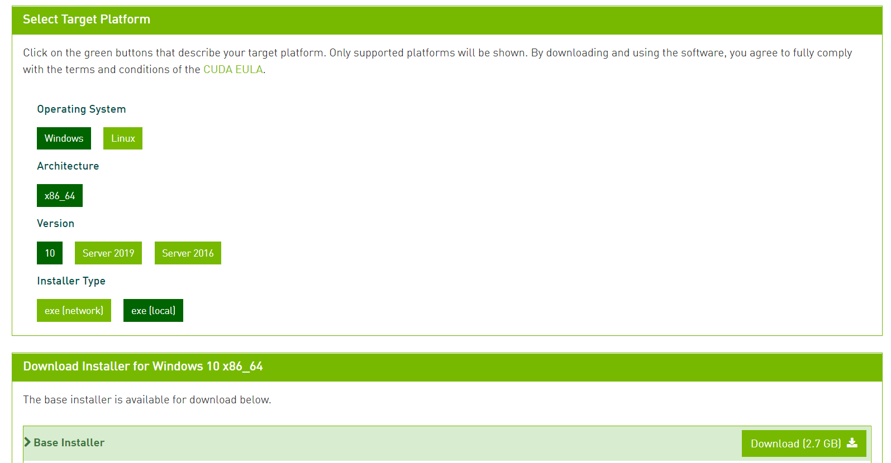
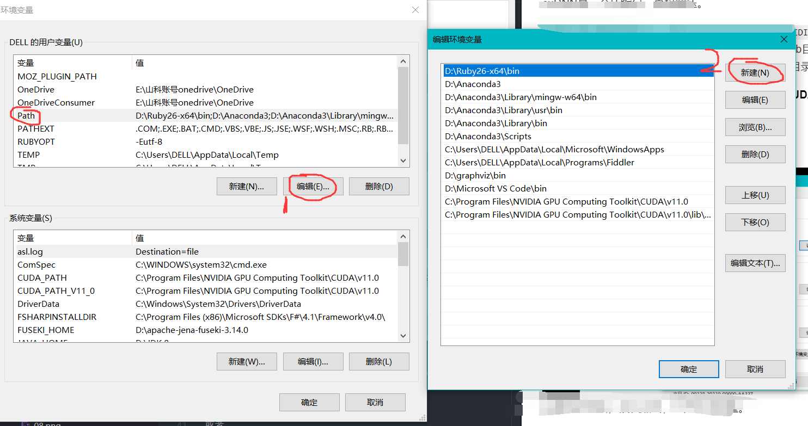
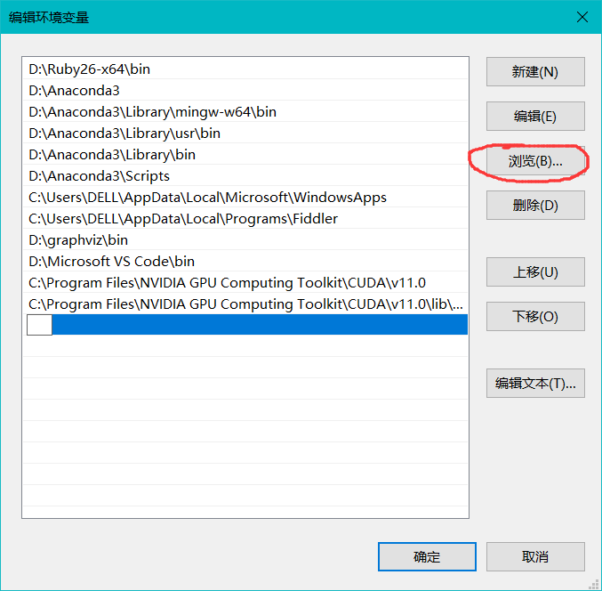

### 1.进入[Torch官网的安装界面](https://pytorch.org/get-started/locally/)

根据自己电脑的配置选择合适的安装版本  
我用的是anaconda，在anaconda prompt界面进行命令行安装，我的CUDA版本是9.1的，因此选择了None。所以全部选择如下：

**注**:至于CUDA的版本，大家可以按照如下步骤来进行查看（仅限安装英伟达的windows）

1. 找到NVIDIA控制面板这个界面。
可以鼠标右键点击桌面进入，也可以在任务栏右下角找到进入

2. 找到帮助，点击系统信息

3. CUDA版本如图

$y = x + 1$

